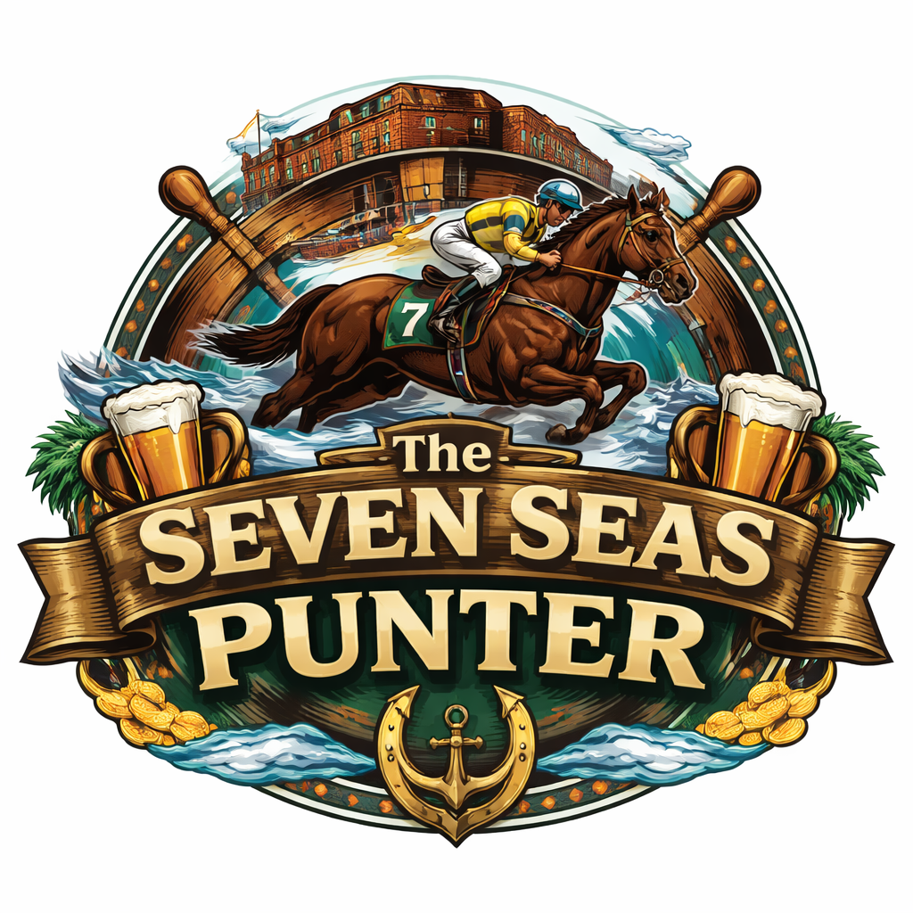

# Seven Seas Punter



Welcome to the Punters Club at the Seven Seas Hotel — where we turn pre-jump markets into pre-pub tall tales. The plan: scoop Betfair data, bottle it into features, train a model that can spot value, and then roll up with a cheeky shortlist of bets that *might* just pay for the next round. And yes, the entire project is vibe coded, plus a healthy dose of “blind coding” when the dev team is at the Sevens and absolutely blind.

Pipeline for Betfair Exchange horse racing: download markets, snapshot odds, build leakage-safe features, train calibrated models, backtest value strategies, and score daily opportunities.

## At a glance
- Build a local DuckDB of markets, runners, and snapshots.
- Train LightGBM models with time-based CV and calibrated probabilities.
- Backtest value strategies with commission and basic execution filters.
- Score “today” (or dry-run) and export a CSV of opportunities.

## Current scope (February 18, 2026)
- Live and pub scoring paths now default to ALL market types unless you set a filter.
- Country defaults are still AU across most commands.
- The project is most battle-tested on horse-racing WIN-style modeling; non-WIN market coverage is available but less validated.

## Repo map
- `workflow/`: CLI entrypoints and orchestration. See `workflow/README.md`.
- `shared/`: core library (Betfair I/O, storage, features, models, backtesting). See `shared/README.md`.
- `research/`: notebooks and experiments. See `research/README.md`.
- `literature_review/`: background PDFs. See `literature_review/README.md`.
- `tests/`: unit tests. See `tests/README.md`.

## Read Next
- Docs hub: `docs/README.md`
- Run commands quickly: `docs/cli_playbook.md`
- Form-intelligence architecture and leakage controls (P0/P1/P2): `docs/form_intelligence_layer.md`
- Understand pub-mode theory (Betfair -> TAB): `docs/pub_domain_adaptation.md`
- Live architecture notes: `docs/live_integration_plan.md`
- Staking/Kelly theory and assumptions: `shared/backtest/README.md`

## Setup
```bash
# requires Python 3.10–3.12
conda env create -f environment.yml
conda activate punter
cp .env.template .env
```
Or, if you want a minimal venv:
```bash
python -m venv .venv && source .venv/bin/activate
pip install -e .
```

## Quick start
One-command optimized run:
```bash
punter go
```
`punter go` now checks DuckDB freshness first:
- skips historic download when snapshots are fresh enough;
- auto-refreshes when snapshots are stale (default: older than 30 days);
- force refresh anytime with `punter go --refresh-historic`.
- enables conservative rescue guardrails by default for decisioning (`min_ev`, `min_edge`, `max_price`, edge-mult cap, plus probability tail safety); disable with `--no-rescue-guards` when running experiments.

Use `punter <command> --help` to tune any step (`download-historic`, `pipeline`, `live`, etc.).

Real historic data:
```bash
punter download-historic --auto
punter pipeline --cutoff-minutes 10
```
Dry-run (no credentials):
```bash
punter quickstart --cutoff-minutes 10
```

Updating data (append new downloads and ingest only new members):
```bash
punter download-historic --auto
punter ingest --incremental
# or
punter pipeline --cutoff-minutes 10 --ingest-new
```

Add a new sport to your local dataset:
```bash
punter download-historic --auto --sport "Greyhound Racing" --market-types ALL --clean-temp
punter pipeline --ingest-new --cutoff-minutes 10
```

## Two practical modes
Automated execution loop (start in dry-run):
```bash
punter live --write-config config/live.yaml
punter live --config config/live.yaml --once --dry-run
punter live --config config/live.yaml --live
```

Manual pub sheet (TAB-focused default):
```bash
punter pub
punter pub --budget 100 --kelly-fraction 0.25 --max-bet-pct 0.2
```

Detailed commands/flags: `docs/cli_playbook.md`.
Pub-mode domain-adaptation design: `docs/pub_domain_adaptation.md`.
Betfair credential details: `shared/betfair/README.md`.
Kelly and bankroll-sizing theory: `shared/backtest/README.md`.

## Where to look next
- Workflow and command surface: `workflow/README.md`
- Model training and prediction internals: `shared/model/README.md`
- Backtesting and stake sizing: `shared/backtest/README.md`
- Storage schema and DuckDB usage: `shared/storage/README.md`
- Betfair API credentials and historic notes: `shared/betfair/README.md`
